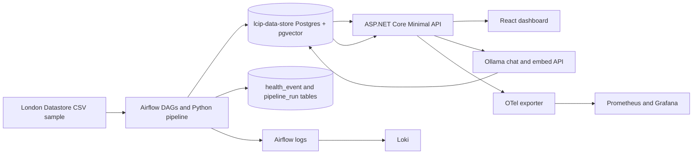
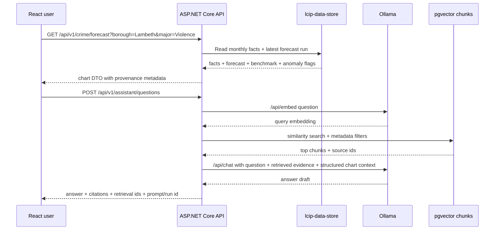
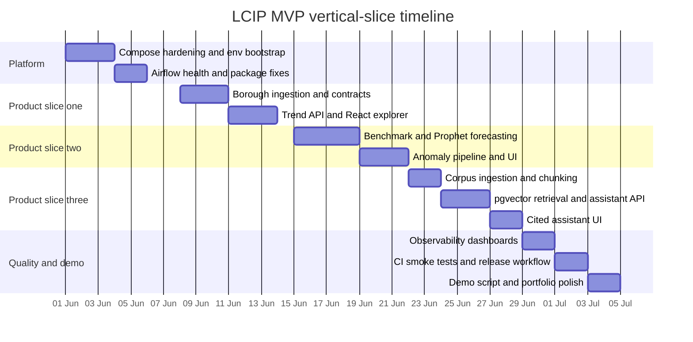

# LCIP polished MVP research report

## Executive summary

The LCIP README is explicit about the product intent: a fully local, zero-subscription AI analytics platform for London crime exploration, forecasting, anomaly detection, local RAG, and observability, built around ASP.NET Core, Python/Airflow, PostgreSQL with pgvector, Ollama, React, and local observability tooling. The public repository also now shows a meaningful infrastructure baseline: a `docker-compose.yml` with a domain-specific Postgres service named `lcip-data-store`, a separate technical Airflow metadata database named `airflow-metadata-store`, and distinct `airflow-init`, `airflow-webserver`, and `airflow-scheduler` services pinned to an `lcip-airflow:2.8.1` image. That separation is exactly the right foundation for a demonstrator that wants to show engineering maturity rather than only model experimentation. citeturn43view0turn37view0

For a single-developer MVP, the highest-value decision is to implement LCIP as **vertical slices** rather than as horizontal layers built in isolation. The right slices are: platform health and developer experience first, then crime trend exploration, then forecast and anomaly analysis, then a tightly-scoped evidence-backed AI investigation assistant, and finally demo polish and CI hardening. This sequencing maximises the chance that every increment is runnable, observable, and demoable, which is especially important for an AI Engineer portfolio piece. It also matches the repo’s stated local-first constraints and current Airflow/Compose-heavy implementation footprint. citeturn43view0turn38view0turn39view0

The best **data starting point** is not the street-level Police API but the London Datastore’s *MPS Recorded Crime: Geographic Breakdown* dataset. It already provides monthly crime counts by borough, ward, and LSOA, by crime type, which maps directly onto the README’s borough-level analytics goal. By contrast, the Police API is street-level, location-anonymised, and updated monthly, which is useful later but creates unnecessary complexity for a first polished slice. The alternative *MPS Monthly Crime Dashboard Data* is also official and refreshed monthly, but it includes multiple geography types in one dataset and explicitly warns about double-counting unless `Area Type` is handled carefully. citeturn31view0turn31view2turn31view3turn31view1

The strongest architecture for this MVP is therefore: Airflow-managed Python ingestion into `lcip-data-store`; ASP.NET Core Minimal APIs as the product-facing backend; React as the visual analytics shell; Ollama for local chat and embeddings; pgvector for document retrieval inside PostgreSQL; and OpenTelemetry plus Prometheus, Grafana, and Loki for observability. Microsoft currently recommends Minimal APIs for new ASP.NET Core API projects, pgvector defaults to exact nearest-neighbour search with perfect recall before you opt into approximate indexes, and Ollama provides a stable local API with explicit `POST /api/embed` support for embeddings. Those characteristics make the stack especially suitable for a careful, portfolio-grade MVP. citeturn28view0turn12view0turn44view1turn44view2

The most important “do less, better” choices are these. Keep Semantic Kernel thin and optional at the orchestration boundary only, because Microsoft’s vector store connectors are still preview; use direct pgvector-backed SQL retrieval instead of abstracting storage too early. Start retrieval with **exact search** rather than HNSW or IVFFlat because the corpus will be small and the docs make clear that ANN indexes trade recall for speed. Implement forecasting with a **seasonal naive benchmark** plus **Prophet baseline** before adding boosted models; add anomaly detection with a transparent univariate baseline before any multivariate detector. Those choices emphasise judgement, correctness, and explainability. citeturn19view0turn19view1turn12view0turn34view0turn34view1turn35search1

## MVP scope and priority use cases

The README describes a system for exploring London crime trends, forecasting short-term patterns, detecting anomalies, answering natural-language questions locally, and tracing every AI result to source data. For a single-developer MVP with a small public London crime CSV sample, the right narrow product proposition is: **“A local London Crime Intelligence workbench that shows borough-level trends, forecasts the next few periods, highlights anomalies, and explains results with citations from local documentation and source metadata.”** That keeps the AI component concrete and defensible instead of turning the project into a generic chatbot. citeturn43view0

The **primary user** should remain the analyst described in the README. They choose a borough, crime category, and date range; inspect historical charts; view a short forecast; review anomaly flags; and optionally ask a bounded question such as “Why is this forecast uncertain?” or “What data source and methodology produced this chart?”. Those questions are answerable from a local RAG corpus consisting of the README, dataset metadata, data dictionary, methodology notes, and model evaluation artefacts. That design keeps the assistant evidence-backed and auditable, which is directly aligned with the project’s stated local explainability goal. citeturn43view0turn31view0

The **first three use cases** should be:

| Use case | User goal | MVP success definition | Why it belongs in MVP |
|---|---|---|---|
| Trend explorer | Inspect borough-level counts over time | User can filter borough/category/date and see responsive charts plus provenance | Directly matches README scope and demo value; low AI risk |
| Forecast and anomaly workbench | See short-horizon forecast and flagged outliers | User sees forecast band, benchmark comparison, and anomaly explanations | Demonstrates practical ML judgement, not just dashboards |
| Evidence-backed AI assistant | Ask questions about the displayed analysis and data source | Every answer shows cited local evidence and retrieval sources | Shows AI engineering depth while staying safe and auditable |

A concrete analyst journey for the polished demo looks like this:

| Step | Actor action | System behaviour |
|---|---|---|
| Select borough and crime type | Analyst chooses borough, category, trailing period | Backend serves aggregated monthly facts from `lcip-data-store` |
| Review forecast | Analyst clicks “forecast” | API returns seasonal-naive benchmark, Prophet forecast, error metrics, uncertainty band |
| Inspect anomaly | Analyst clicks highlighted point | API returns anomaly type, score, baseline context, recent history |
| Ask AI question | Analyst asks “What supports this conclusion?” | Assistant embeds the question, retrieves local corpus chunks and structured context, answers with citations |
| Verify trust | Analyst opens provenance / health tab | App shows dataset version, model run ID, Airflow health, ingestion timestamp |

The **data choice** is central to keeping this slice polished. The recommended MVP ingestion source is *MPS Recorded Crime: Geographic Breakdown* because it already supplies monthly counts at borough level by crime type. The optional second-stage enrichment source is *MPS Monthly Crime Dashboard Data* once the app can safely handle its mixed geography semantics. The Police API should remain a later slice for neighbourhood or map-centric detail, not the first one, because it is street-level and approximate by design. citeturn31view0turn31view1turn31view2

## Architecture and HLD

The architecture should stay very close to the README’s intended stack, but with three clarifications that make it portfolio-ready. First, the **domain datastore** and the **Airflow metadata datastore** must remain separate, exactly as the current Compose file now does. Second, Airflow should own scheduling and pipeline status, but not become the product API. Third, the AI path should be deliberately narrow: retrieval from curated local documents plus structured chart context, not free-form tool use. Those three constraints keep the system understandable, resilient, and easy to explain in interviews. citeturn43view0turn37view0



The **backend shape** should mirror the README folder intent, but implement each feature as a vertical slice inside the application layer. Microsoft recommends Minimal APIs for new ASP.NET Core API apps, and the README already anticipates `LCIP.Api`, `LCIP.Application`, `LCIP.Domain`, and `LCIP.Infrastructure`. The cleanest compromise is: keep those four projects, but organise `LCIP.Application` by feature slice rather than by technical type. For example, `Features/CrimeTrends/GetTrend`, `Features/Forecasts/GetForecast`, `Features/Anomalies/ListAnomalies`, and `Features/Assistant/AskQuestion`. Each slice owns its request DTO, validation, handler, endpoint registration, and tests. citeturn28view0turn43view0

The **Airflow role** should be opinionated and small. Use it for ingestion, transformation, health checks, and model batch runs only. The public repo already contains `platform_health_check_dag.py`, and the Compose file mounts `./airflow/lib` and sets `PYTHONPATH=/opt/airflow`, so the right next step is to formalise that `airflow/lib` tree as a proper Python package and keep health payloads tiny. Airflow’s XCom documentation is clear that XComs are for small serialisable values only, not large dataframes; that is exactly right for exchanging a latest health status JSON, but not for persistent history. Persist health history into `lcip-data-store` instead. citeturn39view0turn37view0turn29view0

The **vector retrieval path** should use pgvector directly inside PostgreSQL. pgvector’s documentation states that exact nearest-neighbour search is the default and gives perfect recall, while HNSW and IVFFlat are approximate and trade recall for speed. For a compact local corpus, exact search is the right first choice because it avoids premature ANN tuning and keeps correctness high. When the corpus grows, prefer HNSW before IVFFlat because pgvector describes HNSW as having the better speed–recall trade-off, while IVFFlat builds faster and uses less memory. Because the LCIP assistant will also need ordinary relational filters such as document type, source, borough, and date, pgvector’s “vectors alongside regular Postgres data” model is especially attractive here. citeturn12view0

The **assistant orchestration** should be intentionally conservative. Semantic Kernel is still a good fit as a lightweight middleware and plugin boundary, and Microsoft positions it as modular, observable middleware for enterprise-grade AI integration. But Microsoft also warns that vector store functionality is still preview. The pragmatic answer is: use Semantic Kernel only if you want a clean abstraction over Ollama chat invocation and prompt filters, but keep retrieval, ranking, and evidence selection in your own infrastructure layer against PostgreSQL. That gives you removeable framework usage instead of framework-shaped lock-in. citeturn19view1turn19view0

A minimal **persistence schema** for the MVP should look like this:

| Table | Core columns | Purpose |
|---|---|---|
| `crime_fact_monthly` | `year_month`, `borough_code`, `borough_name`, `crime_major`, `crime_minor`, `crime_count`, `source_dataset`, `source_version` | Canonical analytical fact table |
| `forecast_run` | `forecast_run_id`, `series_key`, `model_name`, `horizon`, `train_window`, `mae`, `rmse`, `mase`, `created_at` | Versioned forecast metadata |
| `forecast_point` | `forecast_run_id`, `year_month`, `yhat`, `yhat_lower`, `yhat_upper`, `benchmark_yhat` | Forecast outputs |
| `anomaly_event` | `event_id`, `series_key`, `year_month`, `method`, `score`, `severity`, `explanation_json` | Persisted anomaly flags |
| `document_source` | `doc_id`, `title`, `source_uri`, `doc_type`, `version`, `ingested_at` | RAG document registry |
| `document_chunk` | `chunk_id`, `doc_id`, `chunk_index`, `content`, `embedding`, `token_count` | RAG retrieval unit |
| `health_event` | `event_id`, `component`, `status`, `summary`, `checked_at`, `origin_run_id` | Persisted platform and system health |

The **selection of forecasting, anomaly, storage, and embedding options** should be evidence-led:

| Forecasting option | Strengths | Trade-offs | LCIP recommendation | Evidence |
|---|---|---|---|---|
| Seasonal naive | Transparent benchmark; strong for strongly seasonal series; useful reference for MASE and rolling-origin evaluation | No change-point or exogenous modelling | Mandatory benchmark in every forecast slice | citeturn35search1turn35search5 |
| Prophet | `fit`/`predict` API; built-in uncertainty intervals; default weekly/yearly seasonality; custom seasonalities supported | Less flexible than feature-engineered ML when many covariates appear | Primary MVP forecasting model | citeturn34view0turn34view1 |
| Lag-feature XGBoost | Strong non-linear regression capacity; well known and extensible | Requires manual lag/calendar/covariate feature engineering and more tuning | P2 once baseline is proven | citeturn34view2turn43view0 |

| Anomaly option | Strengths | Trade-offs | LCIP recommendation | Evidence |
|---|---|---|---|---|
| Rolling robust z-score with MAD | Interpretable, robust to outliers, ideal for small borough-level univariate series | Limited multivariate expressiveness | Primary MVP anomaly method | citeturn33search1 |
| Isolation Forest | Efficient unsupervised outlier detection by random partitioning | Less intuitive to explain to non-technical users | Add in P2 for richer feature-space anomalies | citeturn21search2turn21search18 |
| Local Outlier Factor | Captures local density deviations relative to neighbours | Harder operational story for time-ordered production data | Research only for later comparison | citeturn21search3turn21search11 |

| Local embedding store | Strengths | Trade-offs | LCIP recommendation | Evidence |
|---|---|---|---|---|
| pgvector | Exact and ANN search in Postgres; relational joins and filters; HNSW and IVFFlat available | Not as specialised as pure vector engines | Best fit for MVP | citeturn12view0 |
| Qdrant | AI-native vector search; payload filtering; local and edge modes | Extra service and more operational surface | Strong alternative if retrieval becomes central product | citeturn23view0turn22search18 |
| Chroma | Retrieval features built in; metadata filtering and full-text support | Another service and persistence model to justify | Good prototyping choice, not best for LCIP’s current Postgres-centric architecture | citeturn23view2 |
| Faiss | Efficient similarity search library with GPU options | Library, not full product database; you own persistence and metadata patterns | Not recommended for first polished MVP | citeturn23view1 |

| Embedding model | Key characteristics | Trade-offs | LCIP recommendation | Evidence |
|---|---|---|---|---|
| `sentence-transformers/all-MiniLM-L6-v2` | 384-dimensional sentence/paragraph encoder; input over 256 word pieces is truncated; 22.7M params | Very light, but shorter context than newer models | Good ultra-light baseline | citeturn27view0turn27view1 |
| `BAAI/bge-small-en-v1.5` | 384 dims; 512 sequence length; retrieval-oriented benchmark profile | Python sentence-transformers path rather than pure Ollama standardisation | Best non-Ollama baseline for English retrieval | citeturn26view0turn26view1 |
| `nomic-embed-text` via Ollama | 2K context; 274MB in Ollama; high-performing open embedding model | Slightly larger runtime footprint than smallest baselines | Good retrieval-first Ollama option | citeturn25view3turn44view0 |
| `embeddinggemma` via Ollama | 300M/308M class model; multilingual; flexible 128–768 dims; 2K tokens; on-device focus | Newer model, somewhat larger local footprint | Best default if you want one all-local Ollama embedding path | citeturn25view2turn32view0turn44view0 |

The **recommended final HLD choice** for the MVP is therefore:
- data source: London Datastore geographic breakdown;
- API style: ASP.NET Core Minimal APIs with feature slices;
- forecast: seasonal naive benchmark plus Prophet;
- anomaly: rolling robust z-score with MAD;
- retrieval store: pgvector with exact search first;
- embeddings: `embeddinggemma` if standardising on Ollama, otherwise `bge-small-en-v1.5`;
- AI orchestration: thin custom service, optionally using Semantic Kernel only at the prompt boundary. citeturn31view0turn28view0turn34view0turn12view0turn44view0turn19view1

A **representative data and API flow** should look like this:



The current Compose file already expresses most of the required service topology. The excerpt below follows the naming conventions already present in the repository and should remain the standard for every slice. citeturn37view0

```yaml
services:
  lcip-data-store:
    image: postgres:16
    container_name: lcip-data-store

  airflow-metadata-store:
    image: postgres:16
    container_name: lcip-airflow-metadata-store

  airflow-init:
    image: lcip-airflow:2.8.1

  airflow-webserver:
    image: lcip-airflow:2.8.1

  airflow-scheduler:
    image: lcip-airflow:2.8.1
```

A practical `.env` starter for the MVP would be:

```dotenv
LCIP_DATA_STORE_DB=lcip
LCIP_DATA_STORE_USER=lcip_app
LCIP_DATA_STORE_PASSWORD=change_me

AIRFLOW_METADATA_DB_NAME=airflow
AIRFLOW_METADATA_DB_USER=airflow
AIRFLOW_METADATA_DB_PASSWORD=change_me

AIRFLOW_ADMIN_USER=admin
AIRFLOW_ADMIN_PASSWORD=change_me
AIRFLOW_ADMIN_EMAIL=admin@example.local

OLLAMA_BASE_URL=http://host.docker.internal:11434
LCIP_API_BASE_URL=http://localhost:5050
LCIP_FRONTEND_BASE_URL=http://localhost:5173
OTEL_EXPORTER_OTLP_ENDPOINT=http://localhost:4317
```

## Vertical-slice implementation plan

The current repository state strongly suggests that the right first milestone is **platform stabilisation rather than feature sprawl**. The repo already contains an Airflow image build, a Compose topology, and a platform health DAG import path that depends on `lib.aggregate.aggregate_health`. That means the first slice should make the environment boring: deterministic startup, deterministic health, deterministic local observability, and reproducible developer onboarding. Once that is stable, every later product slice becomes easier and more credible in a demo. citeturn37view0turn39view0

The **vertical slices** should be delivered in this order:

| Slice | Outcomes | Main tasks | Exit criteria | Estimate |
|---|---|---|---|---|
| Platform foundation | Reliable local environment and operational trust | Harden Compose, package `airflow/lib`, persist health events, expose API health endpoint, seed demo data path | New machine can start app and pass readiness checks | 5 days |
| Crime trend explorer | First end-to-end product value | Ingest monthly borough facts, create trend endpoints, React charts, provenance panel | User can explore filtered trends with source metadata | 6 days |
| Forecast and anomaly workbench | Core analytical value | Seasonal-naive benchmark, Prophet pipeline, anomaly baseline, evaluation views | User can compare baseline vs forecast and inspect flagged anomalies | 7 days |
| AI investigation assistant | Narrow but compelling AI feature | Curated corpus ingest, chunking, embeddings, retrieval, cited answers, audit trail | Assistant answers bounded analysis questions with citations | 7 days |
| Polish and release | Interview-ready finish | Dashboards, smoke tests, CI, screenshots, seeded demo script, docs | One-command demo plus reliable CI | 5 days |

A portfolio-grade timeline for a single developer is realistic at around **six to seven weeks**, allowing for evenings or part-time work:



A few **important implementation notes** belong directly in the plan. The current Compose file uses `airflow db upgrade` during init. Airflow’s current documentation says `db upgrade` was deprecated in favour of `airflow db migrate` from 2.7 onwards. Also, the current init logic uses `airflow users list | awk ...`, but the Airflow CLI supports structured output and explicit `reset-password` and `create` commands. The MVP should therefore replace brittle text parsing with `airflow users list -o json` and move to `airflow db migrate` as part of foundation hardening. citeturn10view0turn8view3turn37view0

The command pattern below is the recommended hardened version. It is aligned with the official Airflow CLI command set and avoids the previous newline/awk class of failures. citeturn8view3turn10view0

```bash
set -euo pipefail

airflow db migrate

if airflow users list -o json | jq -e '.[] | select(.username == env.AIRFLOW_ADMIN_USER)' >/dev/null; then
  airflow users reset-password \
    --username "${AIRFLOW_ADMIN_USER}" \
    --password "${AIRFLOW_ADMIN_PASSWORD}"
else
  airflow users create \
    --username "${AIRFLOW_ADMIN_USER}" \
    --firstname LCIP \
    --lastname Admin \
    --role Admin \
    --email "${AIRFLOW_ADMIN_EMAIL}" \
    --password "${AIRFLOW_ADMIN_PASSWORD}"
fi
```

The Airflow image itself should stay custom and version-pinned. Official Airflow image guidance recommends pinning dependency versions in `requirements.txt` and explicitly pinning `apache-airflow` to the same version as the base image to avoid surprise downgrades or upgrades through dependency resolution. This is directly relevant because the repo already builds a custom Airflow image and currently pins `lcip-airflow:2.8.1`. citeturn40view0turn37view0

## Engineering operating model

The **DevOps stance** for LCIP should be “production-style quality, local-first deployment”. Airflow’s own documentation is blunt that the official Docker Compose quick-start is for learning and exploration and does not provide production-grade security guarantees. That is acceptable here because LCIP is intended as a local demonstrator, but it makes the quality bar even more important: deterministic images, pinned dependencies, explicit health checks, seeded data, and a green CI build are what will make the project feel professional despite staying local. citeturn41view0

The **CI/CD design** should be simple and disciplined:
- one workflow for code quality and tests across Python, .NET, and frontend;
- one workflow that builds the Airflow image and API container and runs a local smoke test with Compose;
- one tagged release workflow that uploads screenshots, OpenAPI JSON, and demo notes as artefacts.

This is also consistent with the README’s mention of GitHub Actions as the intended free-tier CI platform. citeturn43view0

The **testing strategy** should deliberately show engineering maturity across four levels. First, unit tests in Python and .NET for transformations, handlers, retrieval ranking, and prompt composition. Second, contract tests around the shared `contracts/` folder, because the README already positions those contracts as the binding between Python and .NET formats. Third, rolling-origin forecast evaluation against a seasonal naive benchmark using MASE and RMSE, because Hyndman’s forecasting guidance treats naive and seasonal-naive methods as benchmarks and defines MASE relative to those baselines. Fourth, small scenario-based RAG evaluation: a gold set of 15–20 questions about data provenance, methodology, and displayed analysis, scored for citation correctness and unsupported-claim rate. citeturn43view0turn35search1turn35search5

The **observability plan** should be visible enough to impress, but not so large that it becomes theatre. OpenTelemetry .NET supports stable traces, metrics, and logs, and Microsoft documents the key packages for ASP.NET Core, HttpClient, SQL, OTLP, and Prometheus export. Prometheus in turn is designed to scrape instrumented jobs and feed visualisation and alerting tools such as Grafana. Loki’s own label guidance strongly recommends low-cardinality labels and warns against dynamic labels such as trace IDs or order IDs. In practice, that means LCIP should instrument the ASP.NET API with OpenTelemetry, scrape app and system metrics with Prometheus, visualise key panels in Grafana, and ship logs to Loki with labels like `service`, `environment`, `container`, and perhaps `dag_id` where bounded, but never `trace_id` as a label. citeturn16view0turn16view3turn16view1turn16view2

The **minimum dashboard set** should include:
- platform health dashboard: service availability, latest Airflow run, data freshness, and aggregate health status;
- API dashboard: request rate, latency percentiles, error rate, retrieval latency, Ollama round-trip time;
- data science dashboard: forecast MASE/RMSE by series, forecast drift over time, anomaly counts by severity;
- AI dashboard: retrieval hit count, prompt/response durations, citation count per answer, unsupported-answer rate from test set.

The **security and governance plan** should be straightforward and interview-friendly. The README’s local-only design already reduces data-exfiltration and SaaS dependency risk. Build on that by binding services to localhost where possible, keeping the RAG corpus curated and versioned, storing every assistant interaction with retrieval IDs and source chunk references, and returning citations in every answer. For the MVP, do not give the model arbitrary tool use; the assistant only needs retrieval plus structured context from the chart currently on screen. If you choose to use Semantic Kernel, use its filters and middleware model for guardrails rather than handing it ownership of business logic. citeturn43view0turn19view1

A small but important **health architecture** deserves explicit mention. ASP.NET Core health checks can expose readiness and liveness endpoints, and database probes can validate that the backing store is responding. Airflow XComs are valid for passing small health payloads between tasks, but not for long-term storage. The cleanest model is:
- Airflow `db_health_check` and `sys_health_check` tasks return small JSON payloads and also write to `health_event`;
- `platform_health_check` aggregates the latest statuses and persists one platform event;
- the API exposes `/health/live`, `/health/ready`, and `/api/v1/ops/platform-health`;
- the UI consumes the same domain-level health record that the operators see. citeturn28view1turn29view0turn39view0

## Demo script, backlog, and limitations

The **demo** should tell a crisp story rather than trying to show every subsystem. A strong seven-minute script is:

1. Start with `docker compose up` and show the service map: `lcip-data-store`, `airflow-metadata-store`, `airflow-webserver`, `airflow-scheduler`, API, frontend, Ollama. Briefly note that the domain and technical datastores are separated by design. citeturn37view0  
2. Open the React dashboard and choose a borough and crime category. Show the trend chart and provenance panel with dataset version and latest ingestion run.  
3. Switch to the forecast tab. Show the seasonal-naive benchmark first, then the Prophet forecast and error metrics. Make the point that the project values benchmarking over magical-looking AI. citeturn34view0turn35search1  
4. Click an anomaly marker and show the explanation card, including the exact scoring method and recent-window context.  
5. Open the assistant and ask a bounded question such as “What data source powers this chart and why is the forecast uncertain?”. Show the cited answer and the retrieved evidence snippets.  
6. Finish on the operations page: latest Airflow health checks, ingestion freshness, API latency, and logs/metrics dashboards. This is the “AI engineer, not just model tinkerer” moment.

The **prioritised backlog** below assumes one developer and ideal working days, not calendar days:

| Priority | Backlog item | Value | Estimate | Dependency |
|---|---|---:|---:|---|
| P0 | Harden Compose startup and Airflow init script | Very high | 2d | None |
| P0 | Package `airflow/lib` properly and fix aggregate health import chain | Very high | 1d | Compose hardening |
| P0 | Create `health_event` and `pipeline_run` schema | Very high | 1d | Domain DB ready |
| P0 | Implement `/health/live`, `/health/ready`, `/api/v1/ops/platform-health` | Very high | 1d | Health schema |
| P1 | Ingest London Datastore borough monthly crime sample | Very high | 2d | Platform foundation |
| P1 | Build trend slice end to end | Very high | 3d | Ingested facts |
| P1 | Implement forecast benchmark and Prophet slice | Very high | 3d | Trend slice |
| P1 | Implement anomaly baseline and detail view | High | 2d | Trend slice |
| P1 | Persist model run metadata and evaluation metrics | High | 1d | Forecast slice |
| P1 | Ingest local documentation corpus for RAG | High | 2d | pgvector tables |
| P1 | Implement assistant retrieval and cited answer endpoint | Very high | 3d | Corpus ingest |
| P1 | Build assistant UI with citations and audit sidebar | High | 2d | Assistant endpoint |
| P2 | Add OpenTelemetry, Prometheus, Grafana, Loki baseline dashboards | High | 3d | API and logs stable |
| P2 | Add contract tests and rolling-origin forecast evaluation in CI | High | 2d | Forecast slice |
| P2 | Add screenshot-rich README and walkthrough assets | High | 1d | Demo flow stable |
| P2 | Add richer embedding model comparison harness | Medium | 1d | Assistant stable |
| P3 | Add HNSW indexing and performance tuning for larger corpus | Medium | 1d | Corpus growth |
| P3 | Add XGBoost lag-feature experiments | Medium | 2d | Forecast baseline stable |
| P3 | Add neighbourhood map slice from Police API | Lower | 3d | Borough MVP complete |

The **single most important backlog discipline** is this: do not move to the assistant slice until the trend, forecast, anomaly, and health slices are trustworthy. A polished demo for AI Engineer roles wins on *restraint* as much as on capability. A narrow assistant that cites reliable local evidence is much stronger than a broad assistant that improvises. That is also consistent with the README’s emphasis on explainability and traceability rather than generic chat. citeturn43view0

**Open questions and limitations**

The public README is clear about product intent and target stack, and the public repo now exposes meaningful Compose and Airflow artefacts, but I did not fully inspect every backend and frontend source file. As a result, some application-layer structure in this report is a recommendation rather than a reverse-engineering of existing code. citeturn43view0turn36view0

There is also one version-sensitive Airflow detail worth calling out explicitly. The repo currently pins Airflow `2.8.1` in Compose, while the most accessible official docs today are current stable docs. The recommendations above deliberately stick to operational principles that still apply across those versions, and I have explicitly highlighted the one place where version sensitivity matters for LCIP right now: moving the init command pattern from `airflow db upgrade` to `airflow db migrate` and using structured CLI output for user management. citeturn37view0turn10view0turn8view3